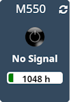

Plugin AcerVP
=============

Plugin para controlar proyectores Acer a través de Jeedom.

> ** Nota **
> Este plugin explota la interfaz web integrada del proyector de video.

** Características: **

- Encender / apagar,
- Visualización de la entrada mostrada,
- Visualización del uso en horas de la lámpara,

** Modelos compatibles **
- Acer M550
- Probablemente otros modelos Acer.

Dashboard
=========

Configuración de plugin
=======================

Después de descargar el plugin, active el plugin.

Configuración del equipo
========================

Se puede acceder a la configuración del equipo desde el menú * Plugins > Multimedia > Acer Video Projecteur *.

### pestaña Equipo:

- ** Nombre del VideoProjector **: nombre de su equipo (ex M550),
- ** Objeto padre **: indica el objeto padre al que pertenece el equipo,
- ** Categoría **: las categorías del equipo (puede pertenecer a varias categorías),
- ** Habilitar **: para activar su equipo,
- ** Visible **: hace que su equipo sea visible en el tablero,
- ** Dirección IP **: dirección IP del proyector.
- ** Login **: usario para conectarse al proyector (guest)
- ** Contraseña **: Contraseña asociada con el usario

### Pestaña Pedidos

Los comandos básicos se generan automáticamente.

### Lista de versiones

*[Ver la lista de versiones](changelog.md)*